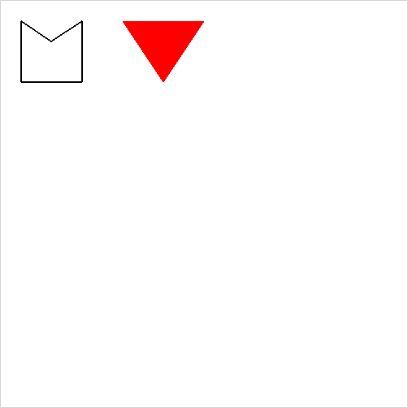

# RossyJS
Rossy is a tiny JavaScript library to create HTML5 games. 
Less than 10 KB in size unminified and without gzip. 

- Drawing
  - `drawLine()`
  - `drawTriangle()`
  - `drawTriangleFilled()`
  - `drawRectangle()`
  - `drawRectangleFilled()`
  - `drawPolygon()`
  - `drawPolygonFilled()`
  - `drawImage()`
- Colors
  - `colorFill()`
  - `colorStroke()`
- Mouse
  - `getMousePosition()`
  - `isMousePressed()`
  - `isMouseReleased()`
  - `isMouseClicked()`
- Keyboard
  - `getKeyName()`
  - `getKeyCode()`
  - `isKeyPressed()`
  - `isKeyReleased()`
  - `isKeyClicked()`
- Images
  - `imageLoad()`
- Audio
  - `audioPlay()`
  - `audioPause()`
  - `audioStop()`
  - `audioVolume()`
  - `audioLoad()`
- Clipping
  - `clip()`
- Time
  - `timeDelta()`
  - `timeElapsed()`
  
## Example
The following example has the game code in the HTML file. When using RossyJS I recommend
you to create a `game.js` file, then include that script by doing `<script src="./game.js"></script>`.

```html
<html>
  <head>
    <link rel="stylesheet" href="./rossy.css">
  </head>
  <body>
    <canvas style="display:block; border:1px solid #d3d3d3;" id="canvas"></canvas>
    
    <script src="./rossy.js"></script>
    <script type="text/javascript">
      rossy = new Rossy(500, 500);
      
      function run() {
        requestAnimationFrame(run);
        rossy.drawPolygon(25, 25, 62, 50, 100, 25, 100, 100, 25, 100);
        rossy.colorFill("#FF0000");
        rossy.drawTriangleFilled(150, 25, 250, 25, 200, 100);
      }

      run();
    </script>
  </body>
</html>
```
The code above will display a window that looks like the following: .

